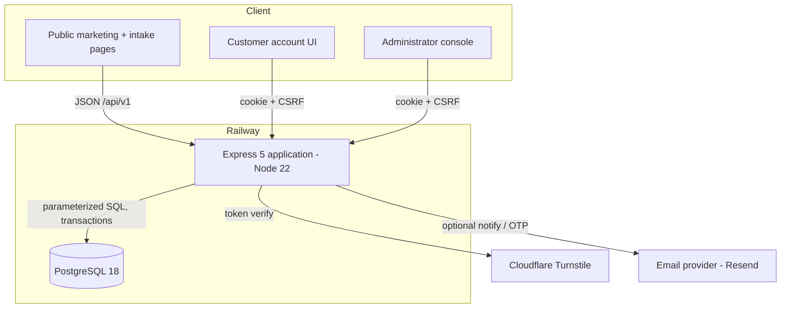
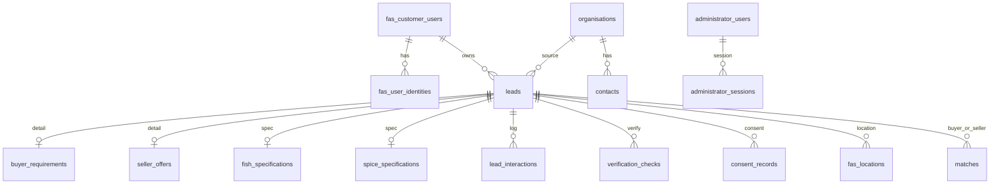
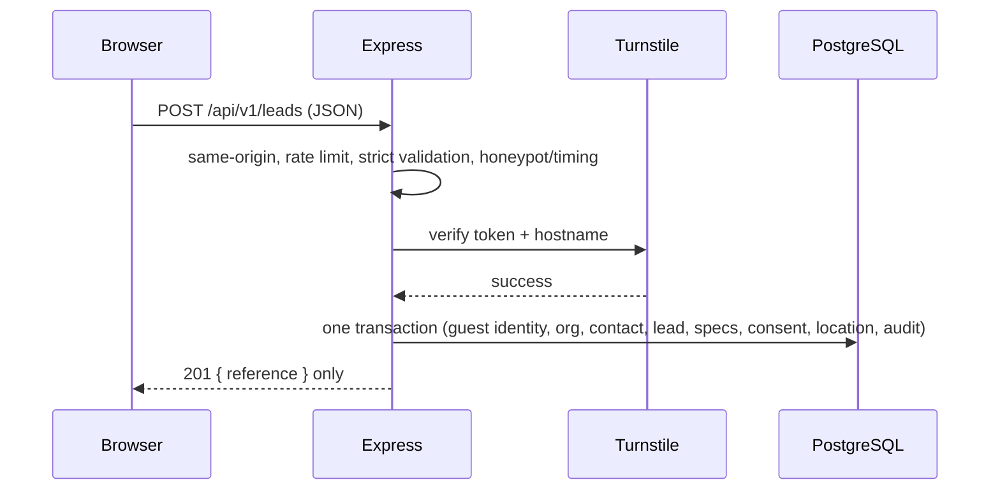
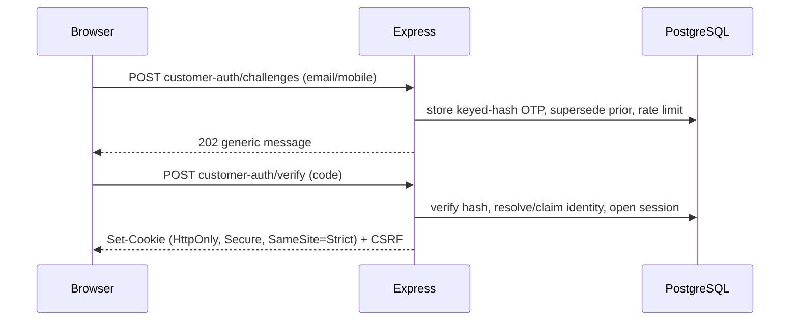

# Fish & Spices — Architecture and Project Assessment

Prepared: 2026-08-15. Scope: the complete FishAndSpices.com application (release candidate `v3.0.0-rc.2`, staging-verified). This document describes the architecture, evaluates the business case honestly, and assesses engineering/product maturity with concrete improvements.

---

## 1. What the product is

Fish & Spices is a **managed B2B lead-qualification and introduction platform** for the seafood and spice export trade. It is not a marketplace with checkout. Its job is to:

- capture structured buying requirements and selling offers from businesses;
- protect the intake from spam, bots and abuse;
- let a guest submit without an account, then optionally verify contact ownership passwordlessly;
- give operators a private workspace to verify parties, record interactions, and propose deterministic buyer/seller matches;
- handle location and personal data with explicit consent and minimisation.

The core value is **trust and qualification** between cross-border trading parties, where fraud, misrepresentation and wasted effort are the main pains.

---

## 2. System architecture

### 2.1 High-level components

### 2.2 Layered design (server)

- **Composition** — `server/app.js` wires Helmet/CSP, JSON limits, same-origin enforcement, static hosting and the API router.
- **Routing** — `server/routes/*` per surface: public leads, admin, customer auth, owner-scoped `me` and locations.
- **Services** — `server/services/*` hold business logic (leads, auth, customer-auth, identity, location, matching, rate-limit, turnstile, notifications).
- **Validation** — `server/validation/lead.js` and `server/services/location.js` enforce strict allowlists.
- **Primitives** — `server/security.js` (hashing, tokens, safe origin), `server/db.js` (pool + `withTransaction`).
- **Config** — `server/config.js` centralises and validates environment.

This is a clean, conventional separation (routes → services → data), which is appropriate and maintainable for the domain.

### 2.3 Data model (core entities)

Schema is delivered by three additive, checksum-locked migrations (`db/migrations/001..003`) applied through an advisory-locked, transactional runner (`scripts/migrate.mjs`).

### 2.4 Request flows

Public lead submission:

Passwordless customer verification:

### 2.5 Technology and deployment

- Runtime: Node.js 22 (ESM), Express 5, `pg`, Helmet, bcryptjs, zod, libphonenumber-js.
- Data: PostgreSQL 18 on Railway.
- Frontend: static HTML/CSS/vanilla JS (progressive enhancement, i18n, device-location module).
- Hosting: Railway; `railway.toml` runs migration predeploy, `npm start`, and health-checks `/api/health`.
- Tests: Vitest, 15 files / 127 tests; static checks validate HTML links and JS syntax.

---

## 3. Security architecture (summary)

Strong, consistently applied controls: opaque hashed sessions, `__Host-` cookies, layered CSRF + same-origin, strict payload allowlists, parameterized SQL in transactions, bcrypt with timing-safe path, database-backed rate limiting, Turnstile, honeypot/timing, least-privilege customer ownership scoping, and (newly) enforced administrator RBAC with validated mutations. Precise location is consent-gated, unverified, and excluded from logs/notifications. A full external handoff exists in `docs/SECURITY_AUDIT_HANDOFF.md`; production remains gated pending independent penetration testing and the items in `docs/PRODUCTION_READINESS.md`.

---

## 4. Is it worth doing as a business?

This is a judgement with reasoning, not a guarantee. The honest view is: **the problem is real and valuable, the current build is a credible foundation, but commercial worth depends on distribution and trust operations that are not yet proven.**

### 4.1 The problem is genuine
Cross-border seafood and spice trade suffers from fraud, unqualified counterparties, quality disputes, and wasted sales effort. Buyers struggle to trust unknown exporters; sellers struggle to reach serious buyers. A qualification-and-introduction layer that reduces fraud and filtering effort has real, tangible value to both sides.

### 4.2 Who it helps
- **Buyers/importers**: fewer time-wasting or fraudulent suppliers; structured requirements.
- **Sellers/exporters**: access to pre-qualified demand; a credibility signal via verification.
- **Operators (the business)**: a defensible position built on verification, data quality, and relationships.

### 4.3 Why the approach is sensible
- Guest-first, passwordless intake lowers friction — critical for B2B lead capture.
- Deterministic, human-in-the-loop matching (not automated introductions) fits a trust-sensitive, compliance-heavy domain.
- Consent, audit and verification are first-class — appropriate for regulated cross-border trade.

### 4.4 The hard parts (where worth is won or lost)
- **Liquidity / cold-start**: value appears only with enough qualified buyers and sellers. This is a distribution and business-development problem, not a code problem.
- **Verification is operational**: the platform records verification, but the trust comes from real diligence (documents, references, inspection) performed by people. That is the true product and cost centre.
- **Monetisation**: introduction/success fees, subscriptions, or verification fees are all plausible, but none is validated yet. Revenue plumbing (payments, contracts, escrow) is intentionally not built.
- **Regulatory exposure**: cross-border personal data, export documentation and liability need legal grounding.

### 4.5 Honest verdict
The concept is **worth pursuing as a service business**, and the software is a strong enabler rather than the differentiator. The differentiator will be **trusted verification and a liquid, high-quality network**. Recommended next validation steps, in order:
1. Manually run 10–20 real qualified introductions (concierge model) using this tool internally, and measure whether parties would pay.
2. Confirm a willingness-to-pay and a specific monetisation model before building payments/commerce.
3. Get legal review for verification claims, liability and cross-border data.
4. Only then invest in automation (payments, richer matching, mobile OTP, document handling).

If those validate, the platform is well-positioned. If they do not, no amount of engineering will create demand — so validate the market before scaling the build.

---

## 5. Does it follow professional software/product practices?

### 5.1 Scorecard

| Area | Rating | Notes |
| --- | --- | --- |
| Architecture and separation | Strong | Clear routes/services/data layering; small, focused modules |
| Security engineering | Strong | Layered, consistent, documented; RBAC and validation hardened |
| Data/migrations | Strong | Additive, checksum-locked, transactional, advisory-locked |
| Testing | Good | 127 tests on critical paths; lacks E2E, load and security regression breadth |
| Documentation | Strong | Architecture, security handoff, readiness, privacy, identity docs |
| Source control discipline | Improving | Now committed and tagged; earlier the deployed code was uncommitted |
| CI/CD | Weak | No automated pipeline; deploys are manual `railway up`; no SAST/secret scan/SBOM |
| Build reproducibility | At risk | Dashboard rebuilds use Railpack (static mis-detection) vs CLI Nixpacks; builder must be pinned |
| Observability | Weak | Structured logs exist; no metrics, alerting, or error tracking |
| Product/release process | Improving | Readiness gates and sign-off matrix defined; not yet exercised end-to-end |

### 5.2 What is already professional
- Threat-aware design with defence in depth and least privilege.
- Idempotent, reversible database evolution.
- Meaningful automated tests and static checks on the important paths.
- Honest, thorough documentation and an explicit production-readiness gate (no "it's secure" hand-waving).
- Staging-first deployment discipline.

### 5.3 What needs improvement (prioritised)
1. **Pin the build.** Force one builder (commit a Dockerfile with `builder = "DOCKERFILE"`, or set the service builder to Nixpacks) so dashboard changes cannot silently deploy a static Caddy build. This is the highest-impact reliability fix.
2. **Add CI/CD.** On every push: `npm ci`, `npm audit`, `npm test`, `npm run check`, secret scanning and SAST, then a gated deploy. Remove manual, unreproducible deploys.
3. **Observability.** Add uptime/health alerting, error tracking, and key business/security metrics (submission rate, OTP abuse, 5xx, DB saturation).
4. **Backup/restore drill + incident runbook.** Prove recovery, not just backups; define on-call and severity handling.
5. **Independent security assessment.** Complete the penetration test in `docs/SECURITY_AUDIT_HANDOFF.md` and remediate before production.
6. **Repository hygiene.** Remove the empty `functions/`, `src/`, `supabase/` scaffolding to avoid confusion and builder mis-detection.
7. **Broaden tests.** Add end-to-end browser tests, load/rate-limit capacity tests, and a security regression suite for RBAC/validation.
8. **Complete product gaps deliberately.** Mobile OTP delivery, retention automation and any commerce features should follow validated demand, not precede it.

### 5.4 Maturity summary
As **engineering**, this is above-average, security-conscious, and maintainable — clearly built by someone applying professional patterns. As a **product/operation**, it is still early: the delivery pipeline, observability, recovery drills, independent security validation and, most importantly, market validation are the gaps between "well-built application" and "professionally operated product/business."

---

## 6. One-page conclusion

- The architecture is clean, secure-by-design, and appropriate for the domain.
- The business problem is real and worth solving; the software is a strong enabler, but success depends on trusted verification operations and network liquidity, which must be validated with real introductions and willingness-to-pay before scaling.
- Engineering practices are professional in design and documentation, but need CI/CD, pinned reproducible builds, observability, recovery drills, and an independent security assessment to be considered a professionally operated product.
- Immediate priorities: pin the builder, stand up CI/CD, and run a small set of real qualified introductions to validate demand before building further automation.
