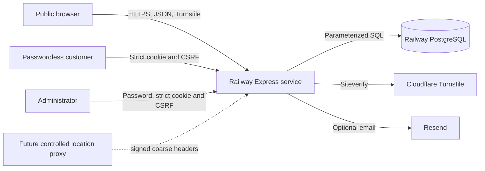

# External security audit handoff

This document is the starting point for a white-box review of the complete FishAndSpices.com application. It describes the intended design, gives reviewers reproducible entry points, and records assumptions that must be challenged. It is not a claim that the system is vulnerability-free.

## Engagement target

- Application: managed B2B lead qualification and consent-based buyer/seller introductions.
- Runtime: Node.js 22, Express 5, PostgreSQL and static browser assets.
- Hosting: Railway application and PostgreSQL services.
- Staging URL: `https://fishandspicescom-staging.up.railway.app`.
- Previously validated staging baseline: `3685a14d-bbd1-4a4c-8d04-17d4aa6aba51`; obtain the active release-candidate deployment ID from the project owner.
- Valid audit target: the future committed release-candidate SHA, not the current uncommitted working tree.
- Production and custom-domain testing require separate written authorization.

## Architecture and trust boundaries



Trust boundaries to test:

1. Untrusted browser input to Express validation and same-origin controls.
2. Session cookies and CSRF tokens to administrator/customer authorization.
3. Express queries and transactions to PostgreSQL constraints.
4. Railway/proxy-derived client IP and future signed location headers.
5. Turnstile and email-provider responses, timeouts and credentials.
6. Administrator actions on private lead, identity, consent and location data.

## Repository map

| Area | Authoritative files |
| --- | --- |
| App composition and headers | `server/app.js`, `server/middleware.js`, `server/config.js` |
| API route mounting | `server/routes/api.js` |
| Public lead intake | `server/routes/leads.js`, `server/validation/lead.js`, `server/services/leads.js` |
| Administrator authentication | `server/routes/auth.js`, `server/auth-middleware.js`, `server/services/auth.js` |
| Passwordless customer identity | `server/routes/customer-auth.js`, `server/customer-auth-middleware.js`, `server/services/customer-auth.js`, `server/services/identity.js` |
| Customer ownership APIs | `server/routes/me.js`, `server/routes/customer-locations.js` |
| Administrator operations | `server/routes/admin.js`, `server/services/audit.js`, `server/services/matching.js` |
| Abuse controls | `server/services/rate-limit.js`, `server/services/turnstile.js` |
| Location and consent | `server/services/location.js`, `assets/js/device-location.js`, `assets/js/lead-form.js` |
| Notifications | `server/services/notifications.js`, `server/services/otp-delivery.js` |
| Database | `server/db.js`, `db/migrations/*.sql`, `scripts/migrate.mjs` |
| Deployment | `railway.toml`, `.env.example`, `docs/deployment.md`, `docs/database.md` |
| Tests | `tests/*.test.js`, `scripts/check-site.mjs`, `scripts/check-js.mjs` |

Supporting design records:

- `docs/PASSWORDLESS_IDENTITY.md`
- `docs/LOCATION_PRIVACY.md`
- `docs/matching-and-retention.md`
- `docs/PRODUCTION_READINESS.md`
- `privacy.html`, `terms.html` and `safety.html`

## Data classification

| Class | Examples | Intended exposure |
| --- | --- | --- |
| Public | static pages, business contact details, health status, Turnstile site key | Internet |
| Public opaque identifiers | lead references | May appear in confirmation and WhatsApp follow-up; never sufficient for private access |
| Private commercial | requirements, offers, quantities, company, contact, matching and verification records | Owner and authorised administrators |
| Personal/contact | email, mobile, name, authentication destination | Owner and authorised administrators; masked where possible |
| Precise/sensitive location | latitude, longitude, accuracy, address details | Owner and authorised operations; never public/log/analytics/notification URL |
| Authentication secret | passwords, OTPs, session/CSRF tokens | Never logged or stored in plaintext; browser receives only its active values |
| Infrastructure secret | database URLs, signing secrets, provider keys | Railway secret store/authorised operators only |
| Audit/security metadata | keyed IP/contact hashes, user-agent hash, auth events, audit rows | Authorised administrators/operators |

The application does not currently support identity-document, bank-statement, certificate or laboratory-file uploads. Reviewers should verify that no route accepts arbitrary files.

## Exposed HTTP surface

Public:

- `GET /api/health`
- `GET /api/v1/public-config`
- `POST /api/v1/leads`
- `POST /api/v1/customer-auth/challenges`
- `POST /api/v1/customer-auth/verify`

Authenticated customer:

- customer session and logout;
- owned lead list/detail and history claim;
- owned location list, create, replace, archive and change request.

Authenticated administrator:

- session/logout;
- overview, lead list/detail/update, interactions and verification;
- match suggestions/create/update;
- location-risk review;
- audit list restricted to administrator and super-admin roles.

Review `server/routes/*.js` for the complete route list and do not infer authorization from frontend visibility.

## Implemented security controls

- Helmet headers, HSTS on hosted HTTPS, frame restrictions, MIME sniffing protection and referrer policy.
- JSON-only API body parser with a 48 KB limit.
- exact-origin enforcement on state-changing API methods.
- strict top-level and nested allowlists for lead and location payloads.
- PostgreSQL parameter binding, constraints, foreign keys and transactions.
- Turnstile validation with expected-hostname checking.
- database-backed submission, administrator-login and OTP rate limits using keyed identifiers.
- bcrypt administrator passwords with a dummy hash path to reduce account timing disclosure.
- random opaque sessions stored only as SHA-256 hashes; HTTP-only, Secure and SameSite Strict cookies in hosted environments.
- separate CSRF token hashes and token rotation.
- short-lived, attempt-limited, single-use, superseding OTP challenges stored as keyed hashes.
- non-enumerating challenge message and conservative identity-history claiming.
- ownership predicates on customer lead/location reads and mutations.
- role checks for audit history; all administrator routes require authentication.
- additive checksum-protected migrations with advisory locking and per-file transactions.
- public lead response and notifications limited to the opaque reference.
- precise location requires explicit action and consent, remains unverified, and is excluded from public review/log/analytics paths.
- transactional audit records for administrative and location changes.

Controls are implementation claims to verify, not accepted audit conclusions.

## Priority attack scenarios

The agency should test at minimum:

1. IDOR/BOLA across customer lead and location IDs, public references, administrator lead IDs and match IDs.
2. Authentication bypass, session fixation/replay, CSRF bypass, cookie scope, logout/revocation and idle/absolute expiry.
3. OTP enumeration, brute force, resend races, concurrent verification, replay, destination normalization and history-claim takeover.
4. Administrator role escalation and whether reviewer permissions match the intended least-privilege policy.
5. SQL injection, stored/reflected DOM XSS, HTML/template injection, prototype pollution and unsafe URL handling across every text field.
6. Turnstile bypass, hostname confusion, duplicate submission races and rate-limit evasion through proxy/header manipulation.
7. `TRUST_PROXY` correctness and spoofing of client IP, `x-request-id`, forwarding and location headers.
8. CSP bypass caused by `'unsafe-inline'`; third-party Turnstile compromise/failure behavior.
9. Sensitive data in API responses, audit records, exception logs, Railway logs, email content, WhatsApp URLs and browser storage/history.
10. Precise location consent bypass, coordinate validation, owner isolation, archive/deletion rules and verification-state promotion.
11. Mass assignment and unsupported enum/state transitions in administrator match, verification and lead update routes.
12. Race conditions and partial writes in lead creation, OTP verification, ownership claiming, location correction and migration execution.
13. Denial-of-service risks from expensive search, unbounded work, connection-pool exhaustion, external-provider waits and repeated health checks.
14. Dependency, lockfile, build and Railway supply-chain integrity; accidental secrets or generated artifacts in Git history/build context.
15. PostgreSQL role privileges, public exposure, TLS path, backup confidentiality, restore integrity and migration rollback/recovery.

## Known concerns and assumptions

These items are already known and must not be reported as undisclosed discoveries without additional impact:

- The current worktree is not committed; a reproducible release candidate must be created before the formal audit.
- No independent penetration test has been completed.
- CSP currently permits inline scripts and styles.
- Administrator MFA is not implemented; compensating access controls have not been approved.
- All authenticated administrator roles inherit the base admin router; only audit history has a narrower role check. The intended reviewer role matrix needs confirmation.
- Mobile OTP delivery is not implemented. Email delivery depends on external provider configuration.
- Automated retention jobs are not implemented; policy periods require legal approval.
- Backup restoration, alerting and incident-response exercises are not yet evidenced.
- Approximate IP location is intentionally disabled until a trusted signed proxy exists.
- Map-provider integration, uploads, payments, escrow, quotations, orders, disputes and protected transactions are outside the current implementation.
- The public domain/request path is not yet documented as the final Railway production route.
- Automated tests use mocked infrastructure and do not replace adversarial or concurrency testing.

## Review environment and rules

Provide the agency:

- read-only access to the exact committed source revision and lockfile;
- an isolated staging environment matching production configuration shape;
- synthetic buyer, seller, reviewer, administrator and super-admin accounts;
- a seeded synthetic dataset and exact-reference cleanup process;
- Railway/application/database logs with secrets and unrelated personal data excluded;
- a written IP range, test window, rate/availability limits and emergency contact.

Do not provide production database credentials or unrestricted production access. Prohibit destructive migration, bulk deletion, denial-of-service, social engineering, third-party provider attacks and access to real customer data unless separately authorised in writing.

## Reproducible reviewer checks

From a clean checkout with a dedicated test database:

```powershell
npm ci
npm audit --omit=dev
npm run migrate
npm test
npm run check
```

The agency should add its own SAST, secret scan, dependency/license analysis, SBOM generation, DAST, authenticated proxy testing and PostgreSQL configuration review. Scanner output must be manually validated.

## Required deliverables

- executive summary and explicit scope/revision;
- architecture and attack-surface confirmation;
- findings with severity, CWE/OWASP mapping, evidence, minimal proof of concept and affected endpoint/file;
- practical remediation and compensating controls;
- separate list of untested areas and environmental limitations;
- retest report showing fixed, partially fixed, accepted or unresolved status;
- final release recommendation, without claiming absolute security.

Critical and High findings must be remediated and retested before production. Medium findings require an owner, deadline and documented risk decision. Secrets exposed during review must be rotated, even if the exposure was temporary.