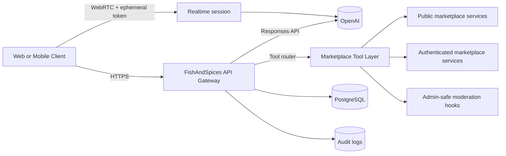

# FishAndSpices AI Marketplace Assistant Architecture

## 1) Purpose and scope

This document defines the production architecture for an AI Marketplace Assistant that:

- supports text and voice interactions,
- supports English, Malayalam, and Hindi user journeys,
- supports anonymous and authenticated users,
- executes secure marketplace actions through existing backend services,
- preserves partner and attribution context during conversion.

The architecture is additive to the current Node.js + Express + PostgreSQL system and reuses existing auth, CSRF, moderation, and marketplace workflows.

## 2) Existing platform baseline

Current backend and deployment surfaces already in place:

- API composition and auth routing: `server/routes/api.js`
- Admin and moderation APIs: `server/routes/admin.js`
- Public marketplace query services: `server/services/marketplace.js`
- Authenticated marketplace actions: `server/routes/marketplace-account.js` and `server/services/marketplace-account.js`
- Runtime config and required envs: `server/config.js`
- Marketplace schema: `db/migrations/005_marketplace_v1.sql`
- Railway deploy flow with predeploy migration and health check: `railway.toml`, `docs/deployment.md`

## 3) Target capability model

The assistant uses two interaction planes:

1. Request/response plane (default):
   - Text chat and tool calling via OpenAI Responses API.
   - Best fit for web chat, authenticated workflows, and server-managed tool execution.

2. Realtime plane (voice-first):
   - Browser/mobile voice sessions via Realtime API with ephemeral credentials.
   - Best fit for low-latency speech-to-speech.

Supporting audio primitives:

- Speech-to-text (file or bounded uploads): `/v1/audio/transcriptions` with `gpt-transcribe`.
- Text-to-speech: `/v1/audio/speech` with `gpt-4o-mini-tts` (voice configurable).
- Realtime browser sessions: issue ephemeral client credentials via `/v1/realtime/client_secrets` on server side.

## 4) High-level system design

### Key rules

- Browser clients never receive long-lived OpenAI API keys.
- All tool execution happens server side.
- Auth-required operations are resolved against existing customer session middleware.
- Admin operations are never available to anonymous or customer tool policies.

## 5) New backend modules (P0)

### 5.1 Routes

- `server/routes/ai-assistant.js`
  - `POST /api/v1/ai/chat`
  - `POST /api/v1/ai/voice/transcribe` (optional bounded upload path)
  - `POST /api/v1/ai/voice/speak`
  - `POST /api/v1/ai/realtime/session` (ephemeral credential broker)

- `server/routes/admin-ai-assistant.js`
  - usage and abuse summaries,
  - kill-switch and policy visibility,
  - per-tool outcome metrics.

### 5.2 Services

- `server/services/ai/openai-client.js`
  - typed wrapper for Responses and Audio APIs.

- `server/services/ai/tool-registry.js`
  - declares function tools and JSON schema,
  - maps model tool calls to internal handlers.

- `server/services/ai/tool-executor.js`
  - policy enforcement by actor type,
  - idempotency and rate-limit guards,
  - structured tool result normalization.

- `server/services/ai/conversation-store.js`
  - persists conversation + message + tool execution events,
  - links anonymous and authenticated histories.

## 6) Data model additions (P0)

Add migration `006_ai_assistant_core.sql` with these tables:

- `fas_ai_conversations`
  - `id uuid pk`
  - `customer_user_id uuid null` (null for anonymous)
  - `anonymous_token_hash text null`
  - `locale text not null`
  - `channel text not null` (`web_text`, `web_voice`, `whatsapp_bridge`, etc.)
  - `source_domain text null`, `source_page text null`, `utm_* text null`
  - `created_at`, `updated_at`, `last_message_at`

- `fas_ai_messages`
  - `id uuid pk`
  - `conversation_id uuid fk`
  - `role text` (`user`, `assistant`, `tool`)
  - `content_text text`
  - `content_json jsonb null` (structured payloads)
  - `language_code text`
  - `model_name text null`
  - `openai_response_id text null`
  - `created_at`

- `fas_ai_tool_calls`
  - `id uuid pk`
  - `conversation_id uuid fk`
  - `message_id uuid fk`
  - `tool_name text`
  - `arguments_json jsonb`
  - `result_json jsonb`
  - `status text` (`completed`, `rejected`, `failed`)
  - `error_code text null`
  - `duration_ms int`
  - `created_at`

- `fas_ai_events`
  - rate-limit and safety actions,
  - moderation flags,
  - escalation and human handoff signals.

## 7) Conversation identity model

### Anonymous

- Client gets an opaque assistant session token (httpOnly cookie or signed token).
- Server stores only hashed token in `fas_ai_conversations`.
- Anonymous tool surface is read-only.

### Authenticated

- Existing customer session in `requireCustomerAuthentication` is authoritative.
- On login, anonymous conversation can be linked to `customer_user_id` through a controlled merge path.
- Write tools require authenticated session and CSRF checks.

## 8) Tooling architecture

Tool selection is policy-based by actor class:

- anonymous: browse/search/detail only,
- authenticated customer: browse + save/contact/quote + dashboard reads,
- admin: separate admin assistant scope with explicit RBAC.

Initial tool set and contracts are defined in `docs/ai-marketplace-assistant-tools.md`.

## 9) Multilingual architecture

- Input language detection is performed by model and reinforced by locale hints.
- Persist user-preferred locale per conversation.
- Assistant responses are generated in user locale unless compliance copy must stay in English.
- Voice path:
  - STT with `gpt-transcribe` + optional `languages` hints,
  - TTS with `gpt-4o-mini-tts` voice profile per locale.

## 10) Partner and attribution continuity

Preserve existing attribution behavior from lead journeys:

- carry `sourceDomain`, `sourcePage`, `referrer`, and `utm_*` fields into `fas_ai_conversations`,
- propagate attribution metadata on conversion tools (contact request, quote draft, lead handoff),
- include attribution in admin analytics and audit logs.

## 11) Reliability and fallback

- Hard timeout budget per model call and per tool call.
- Retry only idempotent read calls.
- If AI call fails, return deterministic fallback card:
  - "browse buyers",
  - "browse sellers",
  - "contact support".

## 12) Implementation phases

### P0

- AI gateway routes,
- core conversation/tool persistence,
- secure marketplace tool router,
- anonymous + authenticated continuity,
- text + bounded voice endpoints.

### P1

- Realtime voice sessions with ephemeral credentials,
- admin AI metrics panel and policy controls,
- advanced multilingual prompt tuning.

### P2

- proactive partner-aware nudges,
- human handoff queue,
- long-horizon personalization with strict privacy controls.
